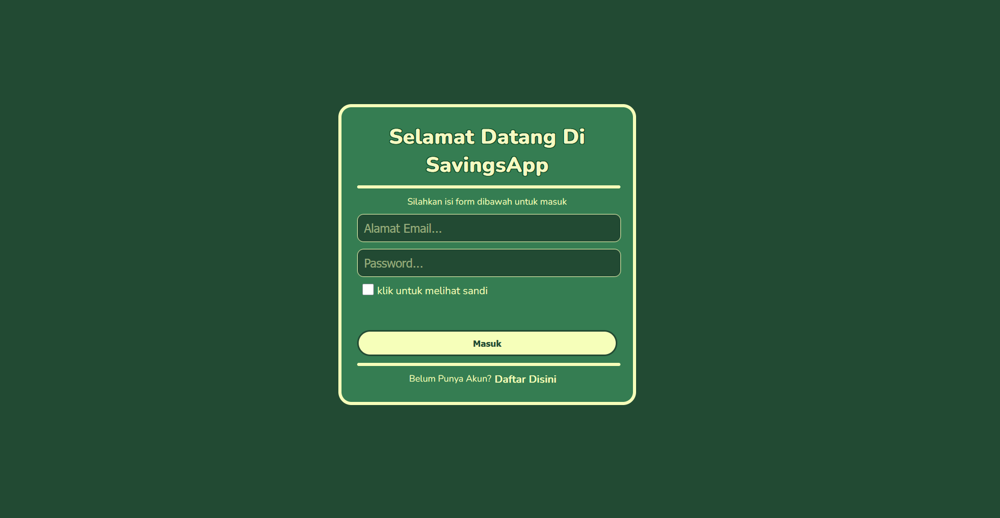
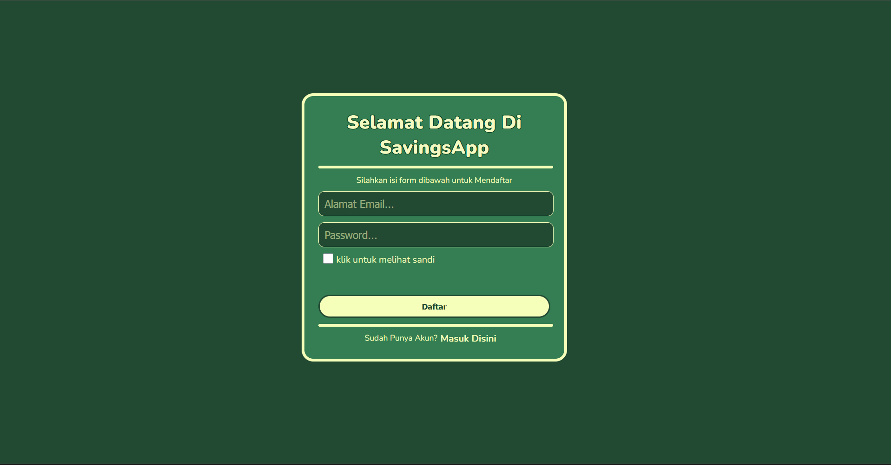
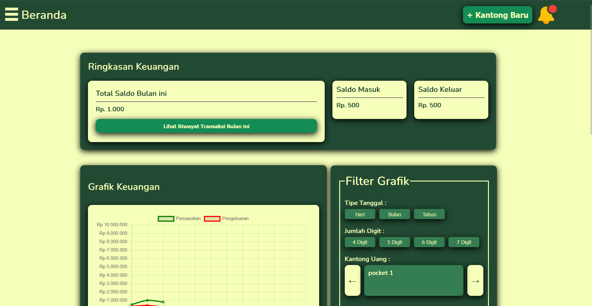
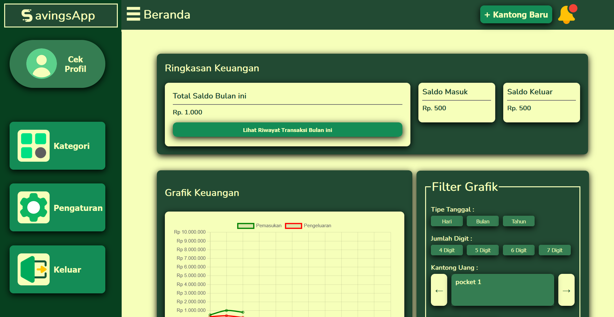
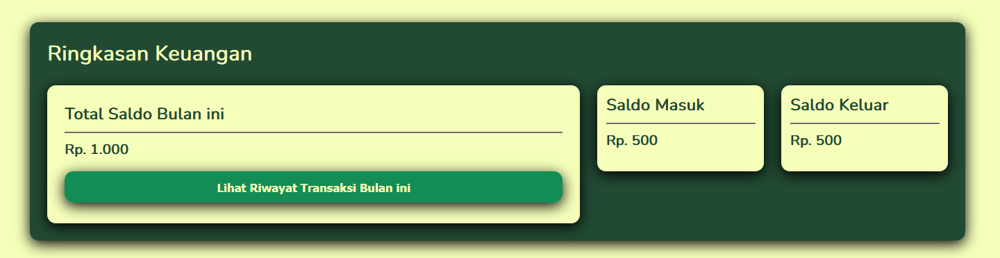
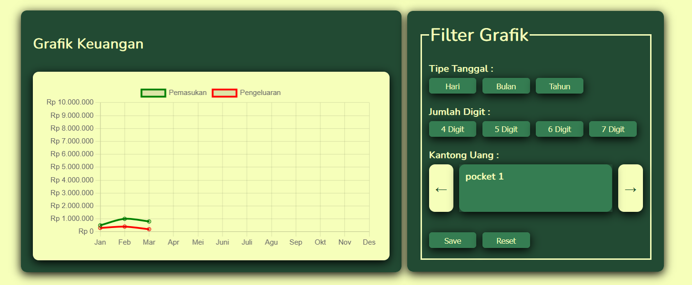
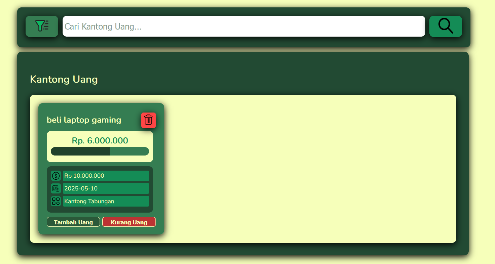
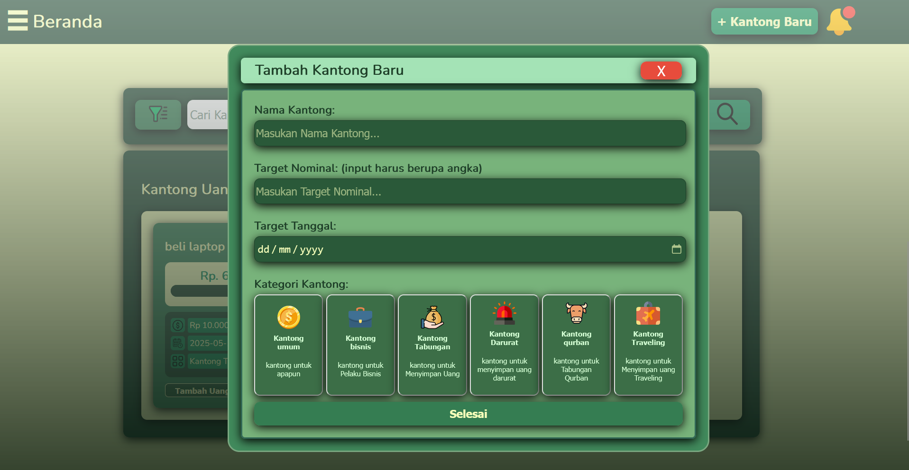
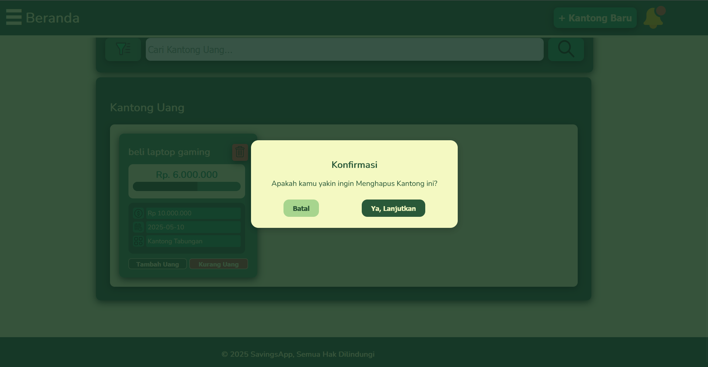

# Savings Web App

 adalah aplikasi berbasis web untuk mengelola "kantong" keuangan secara efisien dan terorganisir. Cocok digunakan untuk budgeting, perencanaan keuangan, atau sekadar memantau pos-pos pengeluaran/simpanan.

---

##  Preview

> *Gambar: Tampilan halaman Login*

> *Gambar: Tampilan halaman Register*

> *Gambar: Tampilan halaman dashboard dengan side bar tertutup*

> *Gambar: Tampilan halaman dashboard dengan side bar terbuka*

---

##  Fitur Utama

###  Dashboard Summary

- **Total Pocket**: Menampilkan jumlah seluruh pocket yang telah dibuat.
- **Total Saldo Masuk**: Total seluruh saldo yang ditambahkan ke pocket.
- **Total Saldo Keluar**: Total seluruh saldo yang dikurangi dari pocket.

###  Chart Monitoring

- Menampilkan grafik pergerakan saldo pocket dari waktu ke waktu.
- **Filterisasi chart** berdasarkan tanggal, jenis transaksi, atau pocket tertentu.

###  Daftar Pocket, Pencarian & Filter Pocket

- Menampilkan seluruh daftar pocket aktif.
- Progress bar visual menunjukkan pencapaian target saldo.
- Pencarian pocket secara real-time.
- Filter pocket berdasarkan kategori atau status.

###  Penambahan Pocket

- Tambahkan pocket baru beserta nama dan target saldo.

###  Penghapusan Pocket

- Hapus pocket dengan konfirmasi, termasuk sinkronisasi ke database dan interface.
